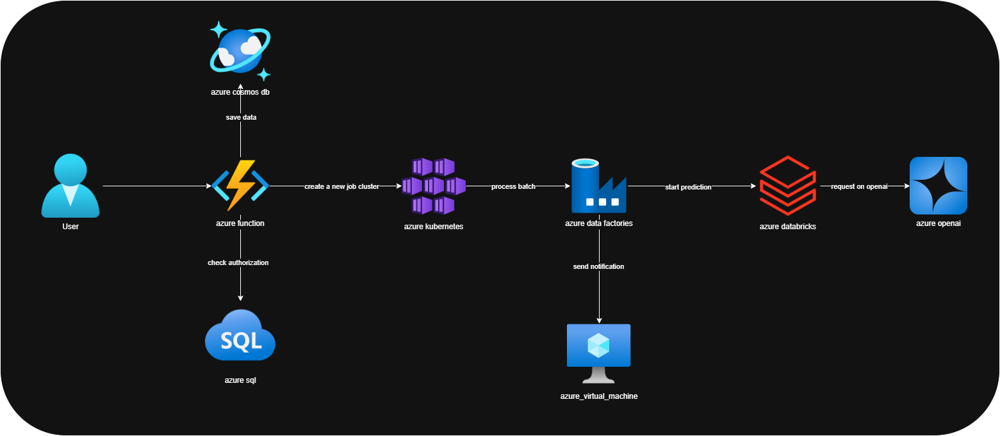

Github link: https://github.com/carlos-rian/fiap-pos-tech/tree/main/05-hacka


Youtube link: https://www.youtube.com/watch?v=r25SkUF9Da8

# FIAP POS Tech - Hackathon Project

## Overview
This project is a solution developed for the FIAP POS Tech Hackathon, focused on processing, augmentation, and analysis of image datasets, as well as integration with generative AI models and training of custom models.

## Make sure to download them before running the project
- [Software Architecture Dataset](https://www.kaggle.com/datasets/carlosrian/software-architecture-dataset): Download the dataset `dataset_augmented` folder from Kaggle and save it in the `src/dataset/` folder. The dataset is large (over 30GB) and contains images and XML files for training.
- [Software Arch Faster C-RNN Cloud Object Detection](https://www.kaggle.com/models/carlosrian/software-architecture-faster-crnn-cloud-object-detection):  Download the trained model `soft-arch_epoch-7_202506251807.pth` file from Kaggle and save it in the `src/models/` folder. The model is a custom Faster R-CNN trained on the dataset, with a size of approximately 160MB.

Note: The model was trained using just a `small subset of the dataset`, **so it is not expected to work well with the full dataset**. The model was trained to demonstrate the process of training and prediction using custom models.

## Kaggle Project Links

This project is hosted on Kaggle and includes the following links for training, prediction, and dataset augmentation:

- [Training *Code*](https://www.kaggle.com/code/carlosrian/soft-arch-predict-model) 
- [Prediction *Code*](https://www.kaggle.com/code/carlosrian/soft-arch-train-model)
- [Augmented *Dataset*](https://www.kaggle.com/datasets/carlosrian/software-architecture-dataset)
- [Trained Model *Data Card*](https://www.kaggle.com/models/carlosrian/software-architecture-faster-crnn-cloud-object-detection)

All images and XMLs used to train were saved in the `src/dataset/dataset_augmented/` folder and listed in the `dataset_output_image.csv` file.

## Prediction Example

### Input Image


---

### Output Predictions and STRIDE Report

This section shows the results of running the trained model on a custom image. The model predicts various Azure services and their bounding boxes in the image.

#### Predictions

**Image**


---

**JSON**

<details>
<summary><strong>📄 JSON Prediction File </strong> (Click Here)</summary>

```json
{
    "predictions": [
        {
            "confidence": 0.9995282888412476,
            "displayName": "azure_data_factories",
            "boundingBox": {
                "xMin": 0.5674349069595337,
                "yMin": 0.3533494174480438,
                "xMax": 0.6286147832870483,
                "yMax": 0.4954019784927368
            }
        },
        {
            "confidence": 0.9975946545600891,
            "displayName": "azure_virtual_machine",
            "boundingBox": {
                "xMin": 0.5643515586853027,
                "yMin": 0.7353216409683228,
                "xMax": 0.63103187084198,
                "yMax": 0.891518771648407
            }
        },
        {
            "confidence": 0.9969965219497681,
            "displayName": "azure_kubernetes_services",
            "boundingBox": {
                "xMin": 0.39855870604515076,
                "yMin": 0.3406761586666107,
                "xMax": 0.4697995185852051,
                "yMax": 0.5059815049171448
            }
        },
        {
            "confidence": 0.9909895062446594,
            "displayName": "azure_databricks",
            "boundingBox": {
                "xMin": 0.7537016868591309,
                "yMin": 0.34498509764671326,
                "xMax": 0.8223376274108887,
                "yMax": 0.5058421492576599
            }
        },
        {
            "confidence": 0.9863126873970032,
            "displayName": "azure_openai",
            "boundingBox": {
                "xMin": 0.9085137844085693,
                "yMin": 0.3553159534931183,
                "xMax": 0.9683898091316223,
                "yMax": 0.495795875787735
            }
        },
        {
            "confidence": 0.9771071076393127,
            "displayName": "user",
            "boundingBox": {
                "xMin": 0.038676727563142776,
                "yMin": 0.34394222497940063,
                "xMax": 0.10105673968791962,
                "yMax": 0.5042659640312195
            }
        },
        {
            "confidence": 0.955901026725769,
            "displayName": "azure_sql",
            "boundingBox": {
                "xMin": 0.19901417195796967,
                "yMin": 0.6770160794258118,
                "xMax": 0.2792859971523285,
                "yMax": 0.8567843437194824
            }
        },
        {
            "confidence": 0.8695687651634216,
            "displayName": "azure_cosmos_db",
            "boundingBox": {
                "xMin": 0.2055007517337799,
                "yMin": 0.03026234544813633,
                "xMax": 0.27563953399658203,
                "yMax": 0.197906494140625
            }
        }
    ],
    "modelInfo": {
        "type": "local_pytorch",
        "model_path": ".../src/models/soft-arch_epoch-7_202506251807.pth"
    }
}
```
</details>


#### STRIDE Report

<details>
<summary><strong>📄 JSON STRIDE Report </strong> (Click Here)</summary>

```json
[
    {
        "component_name": "azure_openai",
        "threats": [
            {
                "threat_category": "S_Spoofing",
                "threat_description": "An attacker could impersonate a legitimate user or service to gain unauthorized access to the azure_openai component.",
                "suggested_countermeasure": "Implement strong authentication mechanisms, such as multi-factor authentication (MFA), to verify the identity of users and services."
            },
            {
                "threat_category": "T_Tampering",
                "threat_description": "An attacker could modify the data being processed or the configuration of the azure_openai component, leading to altered outputs or behavior.",
                "suggested_countermeasure": "Use cryptographic integrity checks (e.g., hashes) and secure configuration management practices to detect and prevent unauthorized changes."
            },
            {
                "threat_category": "R_Repudiation",
                "threat_description": "Users may deny their actions within the azure_openai component, claiming they did not perform certain operations, which could lead to accountability issues.",
                "suggested_countermeasure": "Implement comprehensive logging and monitoring to create an immutable audit trail of all user actions and system events."
            },
            {
                "threat_category": "I_Information_Disclosure",
                "threat_description": "Sensitive data processed or generated by the azure_openai component could be exposed to unauthorized users or attackers.",
                "suggested_countermeasure": "Encrypt sensitive data both at rest and in transit, and enforce strict access controls to limit data exposure."
            },
            {
                "threat_category": "D_Denial_of_Service",
                "threat_description": "An attacker could overwhelm the azure_openai component with excessive requests, causing service disruption or degradation.",
                "suggested_countermeasure": "Implement rate limiting and anomaly detection to mitigate the risk of denial-of-service attacks."
            },
            {
                "threat_category": "E_Elevation_of_Privilege",
                "threat_description": "A user or attacker could exploit vulnerabilities in the azure_openai component to gain elevated access rights beyond their intended permissions.",
                "suggested_countermeasure": "Conduct regular security assessments and apply the principle of least privilege to limit user permissions and access."
            }
        ]
    },
    {
        "component_name": "azure_virtual_machine",
        "threats": [
            {
                "threat_category": "S_Spoofing",
                "threat_description": "An unauthorized user may gain access to the Azure Virtual Machine by impersonating a legitimate user through stolen credentials.",
                "suggested_countermeasure": "Implement multi-factor authentication (MFA) to ensure that access requires more than just a password."
            },
            {
                "threat_category": "T_Tampering",
                "threat_description": "An attacker could modify the configuration or data on the Azure Virtual Machine, leading to altered operations or compromised data integrity.",
                "suggested_countermeasure": "Use Azure Role-Based Access Control (RBAC) to restrict who can modify settings and implement logging to monitor configuration changes."
            },
            {
                "threat_category": "R_Repudiation",
                "threat_description": "Users may perform actions on the Azure Virtual Machine and later deny having done so, potentially leading to accountability issues.",
                "suggested_countermeasure": "Implement comprehensive logging and auditing of user actions on the virtual machine to provide evidence of activity."
            },
            {
                "threat_category": "I_Information_Disclosure",
                "threat_description": "Sensitive data hosted on the Azure Virtual Machine could be exposed to unauthorized users, leading to data breaches.",
                "suggested_countermeasure": "Encrypt sensitive data at rest and in transit, and restrict access to only authorized users using network security groups (NSGs)."
            },
            {
                "threat_category": "D_Denial_of_Service",
                "threat_description": "An attacker could launch a denial of service attack against the Azure Virtual Machine, making it unavailable to legitimate users.",
                "suggested_countermeasure": "Set up Azure DDoS Protection to safeguard against large-scale attacks and monitor traffic patterns for anomalies."
            },
            {
                "threat_category": "E_Elevation_of_Privilege",
                "threat_description": "A user with limited access could exploit vulnerabilities to escalate their permissions and gain unauthorized access to critical resources.",
                "suggested_countermeasure": "Regularly review and update user permissions, applying the principle of least privilege, and conduct vulnerability assessments to identify potential exploits."
            }
        ]
    },
    {
        "component_name": "azure_databricks",
        "threats": [
            {
                "threat_category": "S_Spoofing",
                "threat_description": "An attacker could impersonate a legitimate user or service to gain unauthorized access to Azure Databricks resources.",
                "suggested_countermeasure": "Implement strong authentication mechanisms such as multi-factor authentication (MFA) and use Azure Active Directory for identity management."
            },
            {
                "threat_category": "T_Tampering",
                "threat_description": "Malicious actors could alter the data or configuration settings within Azure Databricks notebooks or jobs, leading to incorrect data processing or analytics.",
                "suggested_countermeasure": "Use access controls and audit logging to monitor changes, and implement data integrity checks to ensure data has not been tampered with."
            },
            {
                "threat_category": "R_Repudiation",
                "threat_description": "Users might deny performing an action (like deleting a notebook or modifying a job), leading to disputes or lack of accountability.",
                "suggested_countermeasure": "Enable comprehensive logging of all user actions and implement non-repudiation measures such as digital signatures."
            },
            {
                "threat_category": "I_Information_Disclosure",
                "threat_description": "Sensitive data processed within Azure Databricks could be exposed due to misconfigurations or insufficient access controls.",
                "suggested_countermeasure": "Enforce strict access controls and encryption for data at rest and in transit to protect sensitive information."
            },
            {
                "threat_category": "D_Denial_of_Service",
                "threat_description": "An attacker could launch a denial-of-service attack against Azure Databricks, making it unavailable for legitimate users.",
                "suggested_countermeasure": "Implement rate limiting, monitoring, and alerting systems to detect and mitigate potential denial-of-service attacks."
            },
            {
                "threat_category": "E_Elevation_of_Privilege",
                "threat_description": "A user or attacker could exploit vulnerabilities to gain higher privileges than intended, allowing unauthorized actions within Azure Databricks.",
                "suggested_countermeasure": "Follow the principle of least privilege (PoLP) by granting users only the permissions they need and regularly reviewing access rights."
            }
        ]
    },
    {
        "component_name": "azure_data_factories",
        "threats": [
            {
                "threat_category": "S_Spoofing",
                "threat_description": "An attacker impersonates a legitimate user to gain unauthorized access to the Azure Data Factory, potentially allowing them to manipulate data pipelines or steal sensitive information.",
                "suggested_countermeasure": "Implement strong authentication mechanisms, such as multi-factor authentication (MFA), to ensure that only legitimate users can access the system."
            },
            {
                "threat_category": "T_Tampering",
                "threat_description": "An adversary alters the configuration of data pipelines or modifies the data being processed within Azure Data Factory, resulting in incorrect data outputs or loss of integrity.",
                "suggested_countermeasure": "Use integrity checks and logging to track changes to configurations and data, and implement role-based access control (RBAC) to limit who can make changes."
            },
            {
                "threat_category": "R_Repudiation",
                "threat_description": "A user may deny having performed an action, such as modifying or deleting a data pipeline, leading to disputes and accountability issues.",
                "suggested_countermeasure": "Ensure comprehensive logging and monitoring of all user actions within Azure Data Factory, and implement non-repudiation mechanisms to provide evidence of user actions."
            },
            {
                "threat_category": "I_Information_Disclosure",
                "threat_description": "Sensitive information may be inadvertently exposed through misconfigured access controls or data leakage during data processing or transfer.",
                "suggested_countermeasure": "Regularly audit access controls and implement encryption for data at rest and in transit to protect sensitive information from unauthorized access."
            },
            {
                "threat_category": "D_Denial_of_Service",
                "threat_description": "An attacker may overwhelm Azure Data Factory with excessive requests, causing legitimate users to experience delays or inability to access the service.",
                "suggested_countermeasure": "Implement rate limiting and traffic monitoring to detect and mitigate potential denial of service attacks."
            },
            {
                "threat_category": "E_Elevation_of_Privilege",
                "threat_description": "A user may exploit a vulnerability to gain higher privileges than intended, allowing them to access or modify resources they should not have access to.",
                "suggested_countermeasure": "Regularly update and patch the Azure Data Factory environment, conduct security reviews, and use principle of least privilege to restrict user permissions."
            }
        ]
    },
    {
        "component_name": "azure_sql",
        "threats": [
            {
                "threat_category": "S_Spoofing",
                "threat_description": "An attacker could impersonate a legitimate user to gain unauthorized access to the database.",
                "suggested_countermeasure": "Implement strong authentication mechanisms, such as multi-factor authentication (MFA) and secure password policies."
            },
            {
                "threat_category": "T_Tampering",
                "threat_description": "An attacker could modify data within the database or alter queries to manipulate the integrity of the data.",
                "suggested_countermeasure": "Use database encryption, integrity checks, and logging mechanisms to detect and prevent unauthorized changes."
            },
            {
                "threat_category": "R_Repudiation",
                "threat_description": "A user could deny performing an action, such as deleting data, if there is insufficient logging.",
                "suggested_countermeasure": "Ensure comprehensive logging of all database operations and implement non-repudiation measures, such as digital signatures."
            },
            {
                "threat_category": "I_Information_Disclosure",
                "threat_description": "Sensitive data could be exposed through improper access controls or vulnerabilities, leading to data breaches.",
                "suggested_countermeasure": "Implement strict access controls, data encryption at rest and in transit, and regular security audits."
            },
            {
                "threat_category": "D_Denial_of_Service",
                "threat_description": "An attacker could overwhelm the database with excessive requests, rendering it unavailable to legitimate users.",
                "suggested_countermeasure": "Deploy rate limiting, web application firewalls (WAF), and monitoring tools to detect and mitigate denial-of-service attacks."
            },
            {
                "threat_category": "E_Elevation_of_Privilege",
                "threat_description": "A user with limited privileges could exploit vulnerabilities to gain higher-level access within the database.",
                "suggested_countermeasure": "Regularly review and audit user permissions, and apply the principle of least privilege to restrict access."
            }
        ]
    },
    {
        "component_name": "azure_kubernetes_services",
        "threats": [
            {
                "threat_category": "S_Spoofing",
                "threat_description": "An attacker could impersonate a legitimate user or service to gain unauthorized access to the Kubernetes cluster.",
                "suggested_countermeasure": "Implement strong authentication mechanisms such as multi-factor authentication (MFA) for users and services accessing the cluster."
            },
            {
                "threat_category": "T_Tampering",
                "threat_description": "Malicious actors could modify the configuration files or container images deployed in the Kubernetes environment, leading to compromised applications.",
                "suggested_countermeasure": "Use image signing and verification processes along with role-based access control (RBAC) to limit who can make changes to configurations and images."
            },
            {
                "threat_category": "R_Repudiation",
                "threat_description": "Users may deny performing actions within the Kubernetes environment, leading to disputes over responsibility for changes or incidents.",
                "suggested_countermeasure": "Implement comprehensive logging and auditing of all actions taken within the cluster to provide accountability and traceability."
            },
            {
                "threat_category": "I_Information_Disclosure",
                "threat_description": "Sensitive information such as secrets, environment variables, or configuration data could be exposed to unauthorized users or services.",
                "suggested_countermeasure": "Utilize Kubernetes Secrets and ensure proper access control policies are in place to restrict access to sensitive data."
            },
            {
                "threat_category": "D_Denial_of_Service",
                "threat_description": "An attacker could overwhelm the Kubernetes cluster with excessive requests, leading to service unavailability.",
                "suggested_countermeasure": "Implement rate limiting and resource quotas to mitigate the impact of potential denial-of-service attacks."
            },
            {
                "threat_category": "E_Elevation_of_Privilege",
                "threat_description": "An attacker could exploit vulnerabilities to gain higher privileges within the Kubernetes cluster, allowing them to perform unauthorized actions.",
                "suggested_countermeasure": "Regularly review and apply the principle of least privilege for user roles, and keep the Kubernetes environment up to date with security patches."
            }
        ]
    },
    {
        "component_name": "azure_cosmos_db",
        "threats": [
            {
                "threat_category": "S_Spoofing",
                "threat_description": "An attacker may impersonate a legitimate user to gain unauthorized access to azure_cosmos_db.",
                "suggested_countermeasure": "Implement strong authentication mechanisms such as multi-factor authentication (MFA) for all users."
            },
            {
                "threat_category": "T_Tampering",
                "threat_description": "Data within azure_cosmos_db may be altered by an unauthorized user, compromising data integrity.",
                "suggested_countermeasure": "Utilize cryptographic hash functions to verify data integrity and implement role-based access controls to limit who can modify data."
            },
            {
                "threat_category": "R_Repudiation",
                "threat_description": "Users may deny performing an action on azure_cosmos_db, leading to issues in accountability.",
                "suggested_countermeasure": "Implement comprehensive logging and monitoring to track user actions, ensuring that logs are tamper-proof."
            },
            {
                "threat_category": "I_Information_Disclosure",
                "threat_description": "Sensitive data stored in azure_cosmos_db may be accessed by unauthorized individuals.",
                "suggested_countermeasure": "Encrypt sensitive data both at rest and in transit, and ensure that access controls are strictly enforced."
            },
            {
                "threat_category": "D_Denial_of_Service",
                "threat_description": "An attacker could launch a denial of service attack against azure_cosmos_db, making it unavailable to legitimate users.",
                "suggested_countermeasure": "Implement rate limiting and anomaly detection to identify and mitigate potential DoS attacks."
            },
            {
                "threat_category": "E_Elevation_of_Privilege",
                "threat_description": "An attacker may exploit vulnerabilities to gain higher privileges than intended on azure_cosmos_db.",
                "suggested_countermeasure": "Regularly conduct security assessments and vulnerability scans, and apply the principle of least privilege to user roles."
            }
        ]
    },
    {
        "component_name": "user",
        "threats": [
            {
                "threat_category": "S_Spoofing",
                "threat_description": "An attacker could impersonate a legitimate user by stealing or guessing their credentials.",
                "suggested_countermeasure": "Implement multi-factor authentication (MFA) to enhance user verification."
            },
            {
                "threat_category": "T_Tampering",
                "threat_description": "An unauthorized user could modify user data or settings, leading to unauthorized actions or data corruption.",
                "suggested_countermeasure": "Use cryptographic techniques such as hashing and digital signatures to ensure data integrity."
            },
            {
                "threat_category": "R_Repudiation",
                "threat_description": "A user could deny having performed an action, such as making a transaction, due to lack of proper logging.",
                "suggested_countermeasure": "Implement comprehensive logging and auditing mechanisms to track user actions."
            },
            {
                "threat_category": "I_Information_Disclosure",
                "threat_description": "Sensitive user information could be exposed through vulnerabilities in the application, such as improper access controls.",
                "suggested_countermeasure": "Enforce strict access control policies and data encryption both at rest and in transit."
            },
            {
                "threat_category": "D_Denial_of_Service",
                "threat_description": "An attacker could launch a denial of service attack, making the user component unavailable to legitimate users.",
                "suggested_countermeasure": "Implement rate limiting and use web application firewalls to mitigate DoS attacks."
            },
            {
                "threat_category": "E_Elevation_of_Privilege",
                "threat_description": "A user could exploit a vulnerability to gain higher privileges than intended, allowing them to perform unauthorized actions.",
                "suggested_countermeasure": "Conduct regular security audits and apply the principle of least privilege for user roles."
            }
        ]
    }
]
```

</details>

---

## Project Structure

```
├── pyproject.toml           # Python project configuration
├── README.md                # Project documentation
├── uv.lock                  # Dependency lockfile
├── dataset_output_image.csv # CSV listing all images and XMLs used for training
├── src/
│   ├── main.py              # Main execution script
│   ├── dataset/
│   │   ├── augment_dataset.py            # Data augmentation script
│   │   ├── generate_dataset_output.py    # Dataset output generation
│   │   ├── dataset_augmented/            # Augmented images and annotations (PNG, XML)
│   │   ├── dataset_base/                 # Base image dataset
│   │   ├── dataset_output/               # Output from dataset processing
│   │   ├── diagram_base/                 # Original diagrams
│   │   ├── diagram_base_optimized/       # Optimized diagrams
│   │   ├── scripts/                      # Auxiliary scripts
│   │   └── test/                         # Dataset-related tests
│   ├── finetunning/
│   │   ├── predict.py      # Prediction script using trained model
│   │   ├── train.py        # Model training script
│   │   └── util.py         # Utilities for training/prediction
│   ├── generative_ai/
│   │   └── chatgpt.py      # Integration with generative AI (ChatGPT)
│   ├── models/
│   │   └── *.pth           # Trained models (PyTorch), please download from the link provided in the warnings section
│   └── output/
│       └── [date]/         # Outputs organized by date of execution
```

## Description of Modules and Folders

- **pyproject.toml**: Manages dependencies and Python project settings.
- **uv.lock**: Lockfile for dependency management with uv.
- **dataset_output_image.csv**: CSV file listing all images and XMLs used for training.
- **src/main.py**: Main entry point for running project flows.
- **src/dataset/**: Scripts and data for handling, augmenting, and testing image datasets.
  - **augment_dataset.py**: Performs data augmentation on images.
  - **generate_dataset_output.py**: Generates processed dataset outputs.
  - **dataset_augmented/**: Contains augmented images and their annotation files (e.g., .png, .xml).
  - **dataset_base/**: Original image dataset.
  - **dataset_output/**: Output from dataset processing.
  - **diagram_base/** and **diagram_base_optimized/**: Original and optimized diagrams.
  - **scripts/**: Auxiliary scripts for data handling.
  - **test/**: Test scripts for data validation.
- **src/finetunning/**: Scripts for training, prediction, and utilities for custom models.
  - **train.py**: Model training (e.g., PyTorch).
  - **predict.py**: Prediction using trained models.
  - **util.py**: Utility functions for the ML pipeline.
- **src/generative_ai/**: Integration with generative AI models.
  - **chatgpt.py**: Communication with the ChatGPT API.
- **src/models/**: Stores trained models (.pth).
- **src/output/**: Processing outputs and results, organized by date.

## How to Run

That step just works if you have the dataset and model files available, otherwise you will need to generate them using the scripts provided in the project.

1. Install dependencies:
   ```bash
   uv sync --python 3.12
   ```

2. Run the main script or specific scripts:
   ```bash
   python src/main.py
   ```

3. To train models:
   ```bash
   python src/finetunning/train.py
   ```

4. For prediction:
   ```bash
   python src/finetunning/predict.py
   ```

## Workflows
The project follows a structured workflow:

- **Dataset**:
   - [Dataset generation and processing](src/dataset/generate_dataset_output.py): Generates the dataset with various transformations. This step will generate 10 new images for each original image with different backgrounds, rotations, and other transformations.
   - [Data augmentation and processing](src/dataset/augment_dataset.py): Augments the dataset, generating 10 new images for each original image based on the generated dataset from the previous step.
- **Model Training**:
   - [Model training](src/finetunning/train.py): After the dataset is generated, this script trains a custom model using the augmented dataset.
- **Model Prediction**:
   - [Model prediction](src/finetunning/predict.py): Uses the trained model to make predictions on new images.
- **Generative AI**:
   - [Generative AI integration](src/generative_ai/chatgpt.py): Integrates with ChatGPT for generating text based on image analysis, using the predictions made by the model.
- **Output Generation**:
   - Outputs are generated in the `src/output/` directory, organized by date of execution.

## Requirements
- Python 3.12+
- UV (for dependency management)
- PyTorch
- OpenCV
- Other dependencies listed in `pyproject.toml`

## Dataset and Model Access

Due to size constraints, the dataset and trained model are not included in this repository. Request access from the project team using the following links:
- [Dataset Kagle link (+30GB)](https://www.kaggle.com/datasets/carlosrian/software-architecture-dataset) save the dataset in the `src/dataset/` folder.
- [Model Kagle link (+150MB)](https://www.kaggle.com/models/carlosrian/software-architecture-faster-crnn-cloud-object-detection) save the model in the `src/models/` folder.

## License
[MIT](LICENSE)
