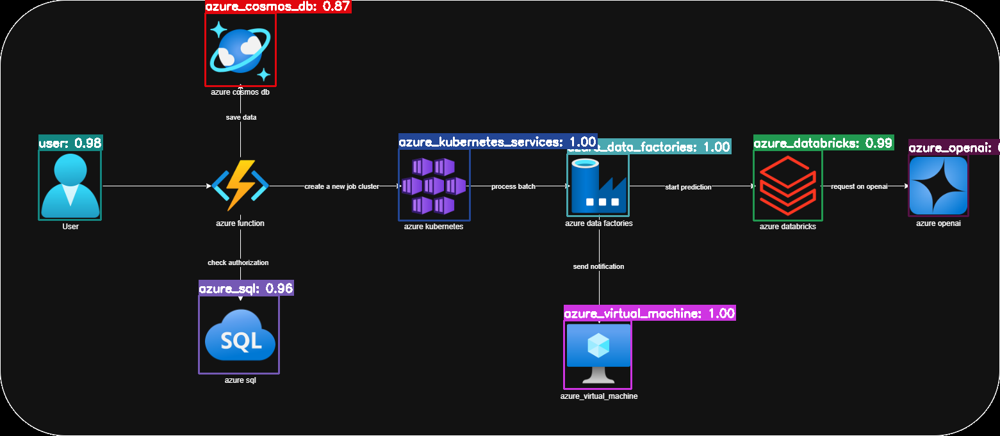

# FIAP POS Tech - Hackathon Project

## Links:
- [Github](https://github.com/carlos-rian/fiap-pos-tech/tree/main/05-hacka)
- [Presentation](https://www.youtube.com/watch?v=r25SkUF9Da8)

## Students:
- Carlos Rian - RM359193
- Djalma Junior - RM359194 

## Overview
This project is a solution developed for the FIAP POS Tech Hackathon, focused on processing, augmentation, and analysis of image datasets, as well as integration with generative AI models and training of custom models.

## Make sure to download them before running the project
- [Software Architecture Dataset](https://www.kaggle.com/datasets/carlosrian/software-architecture-dataset) (*OPTIONAL*): Download the dataset `dataset_augmented` folder from Kaggle and save it in the `src/dataset/` folder. The dataset is large (over 30GB) and contains images and XML files for training.
- [Software Arch Faster C-RNN Cloud Object Detection](https://www.kaggle.com/models/carlosrian/software-architecture-faster-crnn-cloud-object-detection) (*REQUIRED*):  Download the trained model `soft-arch_epoch-7_202506251807.pth` file from Kaggle and save it in the `src/models/` folder. The model is a custom Faster R-CNN trained on the dataset, with a size of approximately 160MB.

Note: The model was trained using just a `small subset of the dataset`, **so it is not expected to work well with the full dataset**. The model was trained to demonstrate the process of training and prediction using custom models.

## Kaggle Project Links

This project is hosted on Kaggle and includes the following links for training, prediction, and dataset augmentation:

- [Training *Code*](https://www.kaggle.com/code/carlosrian/soft-arch-predict-model) 
- [Prediction *Code*](https://www.kaggle.com/code/carlosrian/soft-arch-train-model)
- [Augmented *Dataset*](https://www.kaggle.com/datasets/carlosrian/software-architecture-dataset)
- [Trained Model *Data Card*](https://www.kaggle.com/models/carlosrian/software-architecture-faster-crnn-cloud-object-detection)

All images and XMLs used to train were saved in the `src/dataset/dataset_augmented/` folder and listed in the `dataset_output_image.csv` file.

## Prediction Example

### Input Image


---

### Output Predictions and STRIDE Report

This section shows the results of running the trained model on a custom image. The model predicts various Azure services and their bounding boxes in the image.

#### Predictions

**Image**


---

**JSON**

📄 JSON Prediction File Example

```json
{
    "predictions": [
        {
            "confidence": 0.9863126873970032,
            "displayName": "azure_openai",
            "boundingBox": {
                "xMin": 0.9085137844085693,
                "yMin": 0.3553159534931183,
                "xMax": 0.9683898091316223,
                "yMax": 0.495795875787735
            }
        }
        ...
    ],
    "modelInfo": {
        "type": "local_pytorch",
        "model_path": ".../src/models/soft-arch_epoch-7_202506251807.pth"
    }
}
```


#### STRIDE Report

📄 JSON STRIDE Report Example

```json
[
    {
        "component_name": "azure_openai",
        "threats": [
            {
                "threat_category": "S_Spoofing",
                "threat_description": "An attacker could impersonate a legitimate user or service to gain unauthorized access to the azure_openai component.",
                "suggested_countermeasure": "Implement strong authentication mechanisms, such as multi-factor authentication (MFA), to verify the identity of users and services."
            }
            ...
        ]
]
```


## Project Structure

```
├── pyproject.toml           # Python project configuration
├── README.md                # Project documentation
├── uv.lock                  # Dependency lockfile
├── dataset_output_image.csv # CSV listing all images and XMLs used for training
├── src/
│   ├── main.py              # Main execution script
│   ├── dataset/
│   │   ├── augment_dataset.py            # Data augmentation script
│   │   ├── generate_dataset_output.py    # Dataset output generation
│   │   ├── classes.json                  # Class definitions and mappings for object detection
│   │   ├── dataset_augmented/            # Augmented images and annotations (PNG, XML)
│   │   ├── dataset_base/                 # Base image dataset
│   │   ├── dataset_others/               # Additional dataset files
│   │   ├── dataset_output/               # Output from dataset processing
│   │   ├── diagram_base/                 # Original diagrams
│   │   ├── diagram_base_optimized/       # Optimized diagrams
│   │   ├── scripts/                      # Shell scripts for data processing
│   │   └── software-arch-image-for-test/ # Test images for model validation
│   ├── finetunning/
│   │   ├── predict.py      # Prediction script using trained model
│   │   ├── train.py        # Model training script
│   │   └── util.py         # Utilities for training/prediction
│   ├── generative_ai/
│   │   └── chatgpt.py      # Integration with generative AI (ChatGPT)
│   ├── models/
│   │   └── *.pth           # Trained models (PyTorch), please download from the link provided in the warnings section
│   └── output/
│       └── [date]/         # Outputs organized by date of execution
```

## Description of Modules and Folders

- **pyproject.toml**: Manages dependencies and Python project settings.
- **uv.lock**: Lockfile for dependency management with uv.
- **dataset_output_image.csv**: CSV file listing all images and XMLs used for training.
- **src/main.py**: Main entry point for running project flows.
- **src/dataset/**: Scripts and data for handling, augmenting, and testing image datasets.
  - **augment_dataset.py**: Performs data augmentation on images.
  - **generate_dataset_output.py**: Generates processed dataset outputs.
  - **classes.json**: Contains class definitions and mappings for object detection (113 classes including AWS, Azure, and other cloud services).
  - **dataset_augmented/**: Contains augmented images and their annotation files (e.g., .png, .xml).
  - **dataset_base/**: Original image dataset.
  - **dataset_others/**: Additional dataset files and resources.
  - **dataset_output/**: Output from dataset processing.
  - **diagram_base/** and **diagram_base_optimized/**: Original and optimized diagrams.
  - **scripts/**: Shell scripts for data processing including:
    - Image optimization and resizing
    - File format conversion (SVG to PNG)
    - CSV manipulation and merging
    - File renaming and organization
  - **software-arch-image-for-test/**: Test images for model validation (AWS, Azure diagrams).
- **src/finetunning/**: Scripts for training, prediction, and utilities for custom models.
  - **train.py**: Model training (e.g., PyTorch).
  - **predict.py**: Prediction using trained models.
  - **util.py**: Utility functions for the ML pipeline.
- **src/generative_ai/**: Integration with generative AI models.
  - **chatgpt.py**: Communication with the ChatGPT API.
- **src/models/**: Stores trained models (.pth).
- **src/output/**: Processing outputs and results, organized by date.

## How to Run

That step just works if you have the dataset and model files available, otherwise you will need to generate them using the scripts provided in the project.

1. Install dependencies:
   ```bash
   uv sync --python 3.12
   ```

2. Run the main script or specific scripts:
   ```bash
   python src/main.py
   ```

3. To train models:
   ```bash
   python src/finetunning/train.py
   ```

4. For prediction:
   ```bash
   python src/finetunning/predict.py
   ```

## Workflows
The project follows a structured workflow:

- **Dataset**:
   - [Dataset generation and processing](src/dataset/generate_dataset_output.py): Generates the dataset with various transformations. This step will generate 10 new images for each original image with different backgrounds, rotations, and other transformations.
   - [Data augmentation and processing](src/dataset/augment_dataset.py): Augments the dataset, generating 10 new images for each original image based on the generated dataset from the previous step.
- **Model Training**:
   - [Model training](src/finetunning/train.py): After the dataset is generated, this script trains a custom model using the augmented dataset.
- **Model Prediction**:
   - [Model prediction](src/finetunning/predict.py): Uses the trained model to make predictions on new images.
- **Generative AI**:
   - [Generative AI integration](src/generative_ai/chatgpt.py): Integrates with ChatGPT for generating text based on image analysis, using the predictions made by the model.
- **Output Generation**:
   - Outputs are generated in the `src/output/` directory, organized by date of execution.

## Dataset Classes and Processing Scripts

### Class Definitions
The project includes a comprehensive `classes.json` file that defines 113 different classes for object detection, including:
- **AWS Services**: API Gateway, CloudFront, CloudWatch, DynamoDB, EC2, RDS, S3, Lambda, and more
- **Azure Services**: Virtual Machines, Kubernetes Services, Databricks, OpenAI, SQL, Cosmos DB, Data Factories
- **General Components**: APIs, databases, load balancers, users, networks, and other architectural elements

### Processing Scripts
The `src/dataset/scripts/` directory contains various shell scripts for data processing:
- **compare_folders.sh**: Compare contents between different folders
- **merge_csvs.sh**: Merge multiple CSV files into one
- **optimize_png_universal.sh**: Optimize PNG files for better performance
- **rename_png_files.sh**: Batch rename PNG files
- **rename_png_with_prefix.sh**: Add prefixes to PNG file names
- **resize_png_for_pytorch.sh**: Resize images to PyTorch-compatible dimensions
- **split_csv.sh**: Split large CSV files into smaller chunks
- **svg_to_png.sh**: Convert SVG files to PNG format
- **svg_to_pytorch_data.sh**: Convert SVG files to PyTorch-compatible data format

### Test Images
The `software-arch-image-for-test/` folder contains sample architecture diagrams for testing:
- `aws_pdf_diagram.png`: AWS architecture diagram for testing
- `azure_custom_diagram.png`: Custom Azure architecture diagram
- `azure_pdf_diagram.png`: Azure PDF-derived architecture diagram

## Requirements
- Python 3.12+
- UV (for dependency management)
- PyTorch
- OpenCV
- Other dependencies listed in `pyproject.toml`

## Dataset and Model Access

Due to size constraints, the dataset and trained model are not included in this repository. Request access from the project team using the following links:
- [Dataset Kagle link (+30GB)](https://www.kaggle.com/datasets/carlosrian/software-architecture-dataset) save the dataset in the `src/dataset/` folder.
- [Model Kagle link (+150MB)](https://www.kaggle.com/models/carlosrian/software-architecture-faster-crnn-cloud-object-detection) save the model in the `src/models/` folder.

## License
[MIT](LICENSE)